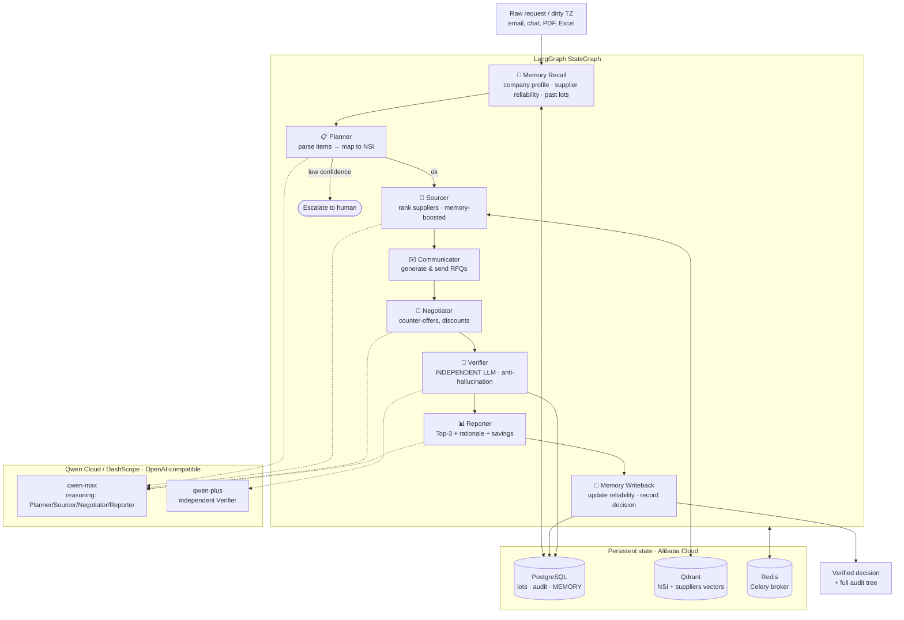

# SnabAgent Architecture — Qwen-Powered Autopilot for Enterprise Procurement

SnabAgent is a **multi-agent Autopilot** that turns a messy, free-text procurement
request ("грязное ТЗ") into a verified, explainable purchasing decision with measurable
savings — fully automatically, with a human only in the loop on escalation.

## Multi-agent pipeline (LangGraph)

## Why this wins on the judging criteria

| Criterion | How SnabAgent scores |
|---|---|
| **Innovation & AI Creativity (30%)** | 8-node multi-agent society on LangGraph with an *independent verifier LLM* and a *persistent memory* loop that makes the agent self-improving. |
| **Technical Depth & Engineering (30%)** | Production stack: FastAPI + Celery + Postgres + Qdrant + Redis, Alembic migrations, PII masking before every LLM call, full audit trail, role-aware Qwen routing (max vs plus). |
| **Problem Value & Impact (25%)** | Enterprise procurement is a trillion-dollar process; SnabAgent yields verifiable **9–11% savings** with explainable Top-3 recommendations. |
| **Presentation (15%)** | Live Streamlit demo, audit tree, measurable metrics (savings %, tokens, model used). |

## Two grounding pillars

1. **Anti-hallucination via an independent verifier.** The Verifier runs on a *different*
   Qwen model (`qwen-plus`) than the primary reasoning model (`qwen-max`), cross-checking
   every supplier offer against the spec, SPARK/INN validity and lead-time constraints.
   The router enforces `primary_model != verifier_model` at startup.

2. **Persistent memory (MemoryAgent).** Before planning, `Memory Recall` loads the
   company's preference profile, accumulated supplier reliability scores and similar past
   lots. After the report, `Memory Writeback` updates those scores (EMA) and records the
   decision — so the agent gets better with every lot it processes.

## Qwen integration in one glance

- OpenAI-compatible endpoint: `https://dashscope-intl.aliyuncs.com/compatible-mode/v1`
- Provider implemented in `src/snabagent/llm/qwen.py`, wired through the same router as
  every other provider (fallback, retry, PII masking, cost metering) — `LLM_PRIMARY=qwen`.
- Role-aware model selection: `role="verifier"` → `qwen-plus`, otherwise → `qwen-max`.

See [`ecs-deployment.md`](./ecs-deployment.md) for the full Alibaba Cloud ECS walkthrough.
